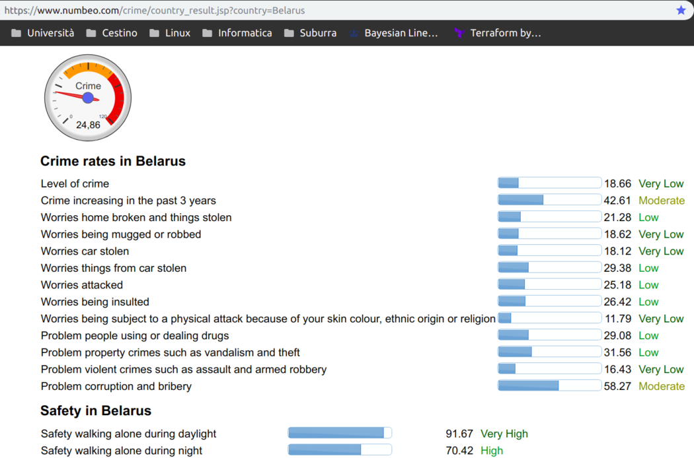

```{r setup, include=FALSE}
knitr::opts_chunk$set(echo = FALSE)
```


## Violence in East Europe: Overview
The aim of this study is about what can be done to improve safety in countries of our fellows East-European citizens.
Many different events, happened in the past, will be taken into consideration.
They're related to:
- Riots
- Protests
- Violence against civilians
- Explosions and remote violence

## ...


> "If you know the enemy and know yourself, you need not fear the result of a hundred battles.
> If you know yourself but not the enemy, for every victory gained you will also suffer a defeat.
> If you know neither the enemy nor yourself, you will succumb in every battle. " Sun Tzu - The art of war

## The Dataset

- Data source: https://www.acleddata.com/
- Considered countries: Belarus, Greece, Moldova, Russia, Ukraine
- Many violent occurrences 

## ...

```{r, echo = FALSE}
library(tidyr)
library(dplyr)
library(readr)
library(tidyimpute)
library(ggplot2)

# Load data
df <- read.csv("../data/CriminalityEastEurope.csv", stringsAsFactors = F)

# drop cols of no use
vars <- colnames(df)
vars
temp.vars <- c(5:7, 30) #event_date,year,time_precision,timestamp
nouse.vars <- c(2:4, 10:12, 13:15, 17, 20:21, 25:28, 31) #iso, evt_id_cnty, event_id_no_cnty, actor1, 
#assoc_actor_1,inter1,actor2, region, assoc_actor2,inter2, admin2, admin3,
#geo_precision, source, source_scale, notes, iso3

unwanted.vars <- c(temp.vars, nouse.vars)
vars <- vars[-unwanted.vars]
df <- df[vars]
# rename columns
colnames(df) <- c("id", "event", "sub_event", "interaction", "country",
                  "city", "location", "latitude", "longitude", "fatalities")

```

## The Dataset 
```{r summaries, echo = TRUE}
print(colnames(df))
```

## Interactions visualization
```{r interaction}
# boxplot interaction 
ggplot(data=df, aes(x=country, y=interaction)) +
  geom_boxplot() +
  stat_summary(fun.y = mean, geom="point", shape=23, size=4)

```

## Interaction vs Fatalities
```{r scatter}
# scatter interaction vs fatalities
ggplot(data=df, aes(x=interaction, y=fatalities)) +
  geom_point()
```

## Violent Occurrences Plot
```{r stacked}
ggplot(data=df, aes(x=city, y=event, fill=sub_event)) +
  geom_bar(stat="identity", ) + 
  theme(axis.text.y = element_blank()) + 
  labs(title='Violence in border eastern Europe')
```

## Violent Occurrences
- Riots
  + Mob violence
  + Violent demonstration
- Protests
  + Protests with (police/security) interventions
  + Excessive force against civilians
- Violence against civilians
  + Attack
  + Abduction / Forced disappearance
- Explosions
  + Grenades
  
## Data wrangling
- Toolbox
  + dplyr: a grammar of data manipulation
  + tidyr: help you get to tidy data
  


https://www.tidyverse.org/


```{r data wrangling, ECHO = FALSE}
# sub events group by events
df.analysis <- df %>% spread(sub_event, event)
ds <- list()
ds[[1]] <- df.analysis %>% filter(df.analysis$country == 'Belarus') %>%
  select(unique(df$sub_event))
ds[[2]] <- df.analysis %>% filter(df.analysis$country == 'Greece') %>%
  select(unique(df$sub_event))
ds[[3]] <- df.analysis %>% filter(df.analysis$country == 'Russia') %>%
  select(unique(df$sub_event))
ds[[4]] <- df.analysis %>% filter(df.analysis$country == 'Ukraine') %>%
  select(unique(df$sub_event))
ds[[5]] <- df.analysis %>% filter(df.analysis$country == 'Moldova') %>%
  select(unique(df$sub_event))

# Vectorization ?? Well, I tried
#ds <- mapply(FUN = function(df, country, sub_event) df %>% filter(df$country == country) %>% select(sub_event),
#              df=df.analysis, 
#             country=unique(df.analysis$country), 
#             sub_event = unique(df$sub_event))


##f <- function(lds,ids,c) {as.integer(lds[[ids]][,c])}
##mapply(FUN = f, lds = ds, ids=1:length(ds), c=1:length(colnames(ds[[1]])))
## doesn't work >: 
for(i in 1:length(ds)){
  for(j in 1:length(colnames(ds[[1]])))
    ds[[i]][,j] <- replace_na(ds[[i]][,j], 0)
  ds[[i]][ ds[[i]] != "0" ] <- "1"
  ds[[i]] <- data.matrix(ds[[i]])
}
```

## Data Wrangling Result
```{r wrangl_out, ECHO = TRUE}
head(ds[[1]]) 
```

```{r bayesian_setup, ECHO = TRUE}
library(rstan)
# Configure Stan library to use multiple cores
options(mc.cores = parallel::detectCores())

# Avoid to recompile each and every time
rstan_options(auto_write = TRUE)

# Grab the data
## The order of the country is "Belarus" "Greece"  "Russia"  "Ukraine" "Moldova"
## Do not permute the columns of the data set! 
## Everything is hardcoded in the .stan file!
n_sub_event <- length(unique(df$sub_event))
N <- c(nrow(ds[[1]]), nrow(ds[[2]]), nrow(ds[[3]]),
       nrow(ds[[4]]), nrow(ds[[5]]))

## The prior are elicited from  #https://www.numbeo.com/crime/country_result.jsp?country=<Country>

informativeness <- 10 # Parameter (to be tuned/chosen)

alpha1 <- informativeness * c(2/13, 3/13, 3/13, 1/13, 1/13, 2/13, 1/13) #Belarus
alpha2 <- informativeness * c(3/17, 2/17, 4/17, 2/17, 2/17, 3/17, 1/17) #Greece
alpha3 <- informativeness * c(2/18, 3/18, 3/18, 3/18, 1/18, 4/18, 2/18) #Russia
alpha4 <- informativeness * c(3/22, 3/22, 4/22, 3/22, 2/22, 5/22, 2/22) #Ukraine
alpha5 <- 10 * c(3/20, 3/20, 3/20, 3/20, 2/20, 5/20, 1/20) #Moldova
```

## Bayesian Model
For each country

- The data generating process is a Multinomial distribution
  + Each parameter is a probability of a specific violent event
- We want to model our prior knowledge
  + Still don't our model to be too constrained
  + We want data to speak, but not for themseves

## Dirichlet Distribution Visualization


## Prior Belief
Our prior belief has been elicited from the website https://www.numbeo.com/crime/country_result.jsp?country=Belarus



## A notice 
- Important 
- Due

## The elicited scores
The scores have to be considered on a scale from 0 to 5 points.

|Registered act of violence          |Belarus | Greece | Russia | Ukraine | Moldova 
-------------------------------------|--------|--------|--------|---------|--------------
|Mob Violence                        | 2      | 3      | 2      | 3       | 3 
|Protest w/ Intervention             | 3      | 2      | 3      | 3       | 3 
|Violent Demonstration               | 3      | 4      | 3      | 4       | 3 
|Attack                              | 1      | 2      | 3      | 3       | 3 
|Abduction                           | 1      | 2      | 1      | 2       | 2 
|Excessive Force against Protesters  | 2      | 3      | 4      | 5       | 5 
|Grenade                             | 1      | 1      | 2      | 2       | 1  


```{r fit, echo = FALSE, warning = FALSE}
stn_code <- read_file("../stan/informative_strata_multinomial_bayesian.stan")

iter <- 15000 
fit <- stan(model_code=stn_code, data=list(N=N, n_sub_event=n_sub_event,
     ds1=ds[[1]], ds2=ds[[2]], ds3=ds[[3]], ds4=ds[[4]], ds5=ds[[5]],
    alpha1=alpha1, alpha2=alpha2, alpha3=alpha3, alpha4=alpha4,
    alpha5=alpha5), iter=iter, chains = 4, control = list(adapt_delta = 0.99), warmup = 2*floor(iter/3))

# Get the draws sampled
post <- as.data.frame(fit)
```

## Trace Plot
```{r traceplt, ECHO = TRUE}
# Traceplot to check convergence of MCMC
traceplot(fit, pars=colnames(post))
```

## Posteriors Plot
```{r postplt0, ECHO = TRUE, warning=FALSE, message=FALSE}
# Plot CI's for posterior theta's
plot(fit, pars=c("theta1[1]", "theta2[1]", "theta3[1]", "theta4[1]", "theta5[1]"), yaxt='n', ann=FALSE) +
  ggtitle("Mob Violence 95/80% CI", paste(unique(df$country), collapse=" ")) +
  scale_y_discrete()
```

## Posteriors Plot
```{r postplt1, ECHO = TRUE, warning=FALSE, message=FALSE}
# Plot CI's for posterior theta's
plot(fit, pars=c("theta1[1]", "theta2[1]", "theta3[1]", "theta4[1]", "theta5[1]"), yaxt='n', ann=FALSE) +
  ggtitle("Mob Violence 95/80% CI", paste(unique(df$country), collapse=" ")) +
  scale_y_discrete()
```

## Posteriors Plot
```{r postplt2, ECHO = TRUE, warning=FALSE, message=FALSE}
plot(fit, pars=c("theta1[2]", "theta2[2]", "theta3[2]", "theta4[2]", "theta5[2]"), yaxt='n', ann=FALSE) +
  ggtitle("Protest w/ Interventions 95/80% CI", paste(unique(df$country), collapse=" ")) +
  scale_y_discrete()
```

## Posteriors Plot
```{r postplt3, ECHO = TRUE, warning=FALSE, message=FALSE}
plot(fit, pars=c("theta1[3]", "theta2[3]", "theta3[3]", "theta4[3]", "theta5[3]"), yaxt='n', ann=FALSE) +
  ggtitle("Violent demostration 95/80% CI", paste(unique(df$country), collapse=" ")) +
  scale_y_discrete()
```

## Posteriors Plot
```{r postplt4, ECHO = TRUE, warning=FALSE, message=FALSE}
plot(fit, pars=c("theta1[4]", "theta2[4]", "theta3[4]", "theta4[4]", "theta5[4]"), yaxt='n', ann=FALSE) +
  ggtitle("Attack 95/80% CI", paste(unique(df$country), collapse=" ")) +
  scale_y_discrete()
```

## Posteriors Plot
```{r postplt5, ECHO = TRUE, warning=FALSE, message=FALSE}
plot(fit, pars=c("theta1[5]", "theta2[5]", "theta3[5]", "theta4[5]", "theta5[5]"), yaxt='n', ann=FALSE) +
  ggtitle("Abduction 95/80% CI", paste(unique(df$country), collapse=" ")) +
  scale_y_discrete()
```

## Posteriors Plot
```{r postplt6, ECHO = TRUE, warning=FALSE, message=FALSE}
plot(fit, pars=c("theta1[6]", "theta2[6]", "theta3[6]", "theta4[6]", "theta5[6]"), yaxt='n', ann=FALSE) +
  ggtitle("Excessive force against civilians 95/80% CI", paste(unique(df$country), collapse=" ")) +
  scale_y_discrete()
```

## Posteriors Plot
```{r postplt7, ECHO = TRUE, warning=FALSE, message=FALSE}
plot(fit, pars=c("theta1[7]", "theta2[7]", "theta3[7]", "theta4[7]", "theta5[7]"), yaxt='n', ann=FALSE) +
  ggtitle("Granede 95/80% CI", paste(unique(df$country), collapse=" ")) +
  scale_y_discrete()
```

## Posteriors Plot
```{r postplt8, ECHO = TRUE, warning=FALSE, message=FALSE}
bayesplot::mcmc_areas(post[c("theta1[1]", "theta2[1]", "theta3[1]", "theta4[1]", "theta5[1]")]) +
  ggtitle("Mob Violence Posteriors", "with medians and 80% intervals") +
  scale_y_discrete(labels=c("Moldova", "Ukraine","Russia", "Greece", "Belarus"))
```

## Posteriors Plot
```{r postplt9, ECHO = TRUE, warning=FALSE, message=FALSE}
bayesplot::mcmc_areas(post[c("theta1[2]", "theta2[2]", "theta3[2]", "theta4[2]", "theta5[2]")]) +
  ggtitle("Protest w/ intervention Posteriors", "with medians and 80% intervals") +
  scale_y_discrete(labels=c("Moldova", "Ukraine","Russia", "Greece", "Belarus"))
```

## Posteriors Plot
```{r postplt10, ECHO = TRUE, warning=FALSE, message=FALSE}
bayesplot::mcmc_areas(post[c("theta1[3]", "theta2[3]", "theta3[3]", "theta4[3]", "theta5[3]")]) +
  ggtitle("Violent demostration Posteriors", "with medians and 80% intervals") +
  scale_y_discrete(labels=c("Moldova", "Ukraine","Russia", "Greece", "Belarus"))
```

## Posteriors Plot
```{r postplt11, ECHO = TRUE, warning=FALSE, message=FALSE}
bayesplot::mcmc_areas(post[c("theta1[4]", "theta2[4]", "theta3[4]", "theta4[4]", "theta5[4]")]) +
  ggtitle("Attack Posteriors", "with medians and 80% intervals") +
  scale_y_discrete(labels=c("Moldova", "Ukraine","Russia", "Greece", "Belarus"))
```

## Posteriors Plot
```{r postplt12, ECHO = TRUE, warning=FALSE, message=FALSE}
bayesplot::mcmc_areas(post[c("theta1[5]", "theta2[5]", "theta3[5]", "theta4[5]", "theta5[5]")]) +
  ggtitle("Abduction Posteriors", "with medians and 80% intervals") +
  scale_y_discrete(labels=c("Moldova", "Ukraine","Russia", "Greece", "Belarus"))
```

## Posteriors Plot
```{r postplt13, ECHO = TRUE, warning=FALSE, message=FALSE}
bayesplot::mcmc_areas(post[c("theta1[6]", "theta2[6]", "theta3[6]", "theta4[6]", "theta5[6]")]) +
  ggtitle("Excessive force against civilians Posteriors", "with medians and 80% intervals") +
  scale_y_discrete(labels=c("Moldova", "Ukraine","Russia", "Greece", "Belarus"))
```
## Posteriors Plot
```{r postplt14, ECHO = TRUE, warning=FALSE, message=FALSE}
bayesplot::mcmc_areas(post[c("theta1[7]", "theta2[7]", "theta3[7]", "theta4[7]", "theta5[7]")]) +
  ggtitle("Grenade Posteriors", "with medians and 80% intervals") +
  scale_y_discrete(labels=c("Moldova", "Ukraine","Russia", "Greece", "Belarus"))
```


## Difference and Frequency of Crimes
```{r variationplt, echo=FALSE, warning=FALSE, message=FALSE}
## in different populations
draws <- c()
country <- c()
country_names <- unique(df.analysis$country)
outcomes <- c(1,2,3,4,5,6,7) # 1:"Mob violence", ..., 7:"Grenade"
for(i in 1:5){
  thetas <- data.frame(post %>% select(contains(paste0("theta", i))))
  thetas <- as.vector(mapply(mean, x=thetas))
  draws <- c(draws,sample(outcomes, 1000, replace=TRUE, prob=thetas))
  country <- c(country, rep(country_names[i], length(draws)))
}
ggplot(data=data.frame(draws,country), aes(x=country, y=draws, fill=draws)) +
  geom_bar(stat="identity") + 
  theme(axis.text.y = element_blank()) + 
  labs(title='Violence in border eastern Europe')
```
